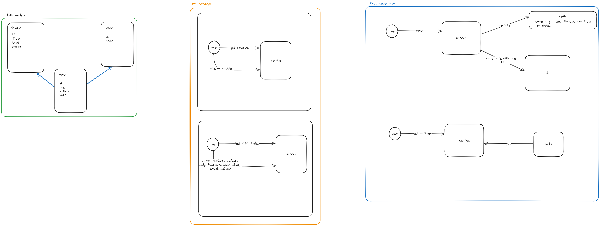

# Article Back-end

This repo is provided to have load resilient back-end for a simple web app that save articles and votes on it

We will use postgres for db and redis for in memory db 
## Installation
make sure you have docker installed. Then
```bash
docker compose up
```

## documentation
### first design
Here 
